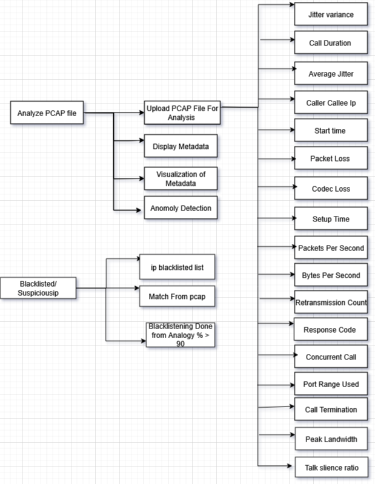

# 🛡 Meta Hunter – Tracking VoIP Calls via Network Metadata  

  

> 🚀 A project developed for *National CyberShield Hackathon 2025* by Team *Meta Hunters*, VIT Bhopal  

---

## 📛 Badges  

  
  
  
  
  
  
  
  
  

  
  

---

## 📌 Problem Statement  
VoIP (Voice over Internet Protocol) calls are widely used because of their low cost and accessibility. Unfortunately, criminals misuse them for *fraud, spam, and cybercrimes*. Traditional methods fail, especially when calls are encrypted.  

---

## 💡 Proposed Solution  
🔍 Our system tracks *VoIP calls using network metadata* instead of intercepting content.  

- Collect SIP & RTP metadata (IP addresses, timestamps, call duration, packet size trends)  
- Correlate traffic patterns across networks  
- Use *AI-driven anomaly detection* to identify fraud/spam calls  
- Non-intrusive: Works even with encrypted VoIP  

---

## ⚙ Technical Approach  

### 🛠 Technologies & Tools  
- *Languages & Frameworks:* Python, Scikit-learn  
- *Network Tools:* Wireshark/TShark, Elasticsearch  
- *Protocols:* SIP, RTP/SRTP  
- *Data Sources:* PCAP files, NetFlow/IPFIX  

### 🤖 Machine Learning Methodology  
- *Anomaly Detection*: Isolation Forest, DBSCAN  
- *Pattern Analysis*: Clustering Algorithms  
- *Visualization*: Dashboards & Reports  

---

## 🔬 Methodology  
1. *Data Collection* → Capture SIP headers, call metadata  
2. *Pre-processing* → Extract identifiers, session durations  
3. *Analysis* → Correlate across multiple networks  
4. *ML Models* → Detect anomalies (spam campaigns, spoofing)  
5. *Visualization* → Interactive dashboards  

---

## 🌍 Impact & Benefits  

✅ *Social* – Protects citizens from scam calls  
💰 *Economic* – Reduces telecom fraud losses  
🔒 *Security* – Strengthens national cybercrime prevention  

---

## 📊 Architecture Diagram  
  

  

---

## 📚 Research & References  
- [Scam and Fraud Detection in VoIP Networks (ResearchGate)](https://www.researchgate.net/publication/254047289_Scam_and_fraud_detection_in_VoIP_Networks_Analysis_and_countermeasures_using_user_profiling)  
- [Kerberos: Real-time Fraud Detection System](https://www.researchgate.net/publication/311550265_Kerberos_a_real-time_Fraud_Detection_System_for_IMS-enabled_VoIP_networks)  
- [VoIP Security - Attacks & Solutions](https://www.researchgate.net/publication/220449868_VoIP_Security_-_Attacks_and_Solutions)  
- [High-Speed Network Traffic Analysis (IEEE Xplore)](https://ieeexplore.ieee.org/document/7796849/)  

---

## 👨‍💻 Team Meta Hunter  

👥 *Team Members:*  
- [SHUBRAT MISHRA]  
- [KABIR ROY]  
- [SHREYAS DESAI]  
- [PRACHI BIRLE]
- [ARITRA MAHANTY]  

🏫 *Institution:* Vellore Institute of Technology, Bhopal  
🏆 *Hackathon:* National CyberShield Hackathon 2025  

---

## 🖼 Screenshots / Demo  
(Add screenshots of your UI, packet analysis, ML output here)  

---

## 🏆 Acknowledgment  
Special thanks to our mentors and *National CyberShield Hackathon 2025* organizers.  

---

✨ Built with ❤ by *Meta Hunter* | VIT Bhopal
