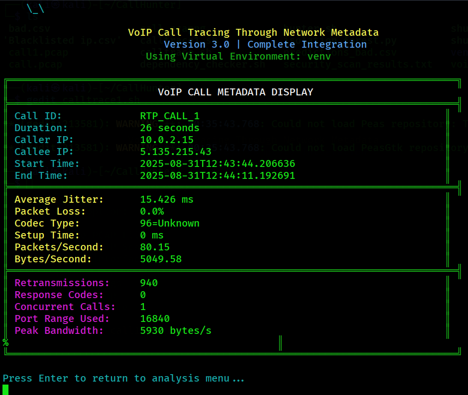

# 🛡 Meta Hunter – Tracking VoIP Calls via Network Metadata  

<p align="center">
  
</p>

> 🚀 A project developed for *National CyberShield Hackathon 2025* by Team *Meta Hunters*, VIT Bhopal  

---

## 📛 Badges  

  
  
  
  
  
  
  
  
  

  
  

---

## 📌 Problem Statement  
VoIP (Voice over Internet Protocol) calls are widely used because of their low cost and accessibility. Unfortunately, criminals misuse them for *fraud, spam, and cybercrimes*. Traditional methods fail, especially when calls are encrypted.  

---

## 💡 Proposed Solution  
🔍 Our system tracks *VoIP calls using network metadata* instead of intercepting content.  

- Collect SIP & RTP metadata (IP addresses, timestamps, call duration, packet size trends)  
- Correlate traffic patterns across networks  
- Use *AI-driven anomaly detection* to identify fraud/spam calls  


---

## ⚙ Technical Approach  

### 🛠 Technologies & Tools  
- *Languages & Frameworks:* Python, Scikit-learn  
- *Network Tools:* Wireshark/TShark, Elasticsearch  
- *Protocols:* SIP, RTP/SRTP  
- *Data Sources:* PCAP files, NetFlow/IPFIX  

### 🤖 Machine Learning Methodology  
- *Anomaly Detection*: Isolation Forest, DBSCAN  
- *Pattern Analysis*: Clustering Algorithms  
- *Visualization*: Dashboards & Reports  

---

## 🔬 Methodology  
1. *Data Collection* → Capture SIP headers, call metadata  
2. *Pre-processing* → Extract identifiers, session durations  
3. *Analysis* → Correlate across multiple networks  
4. *ML Models* → Detect anomalies (spam campaigns, spoofing)  
5. *Visualization* → Interactive dashboards  

---
## 🔧 Installation

### Step 1: Clone the Repository
```bash
# Clone the project
git clone https://github.com/Lonewolf124/Call_Hunters.git
cd Call_Hunters

# Make the main script executable
chmod +x calltrace1.sh
```

### Step 2: Install System Dependencies

#### Ubuntu/Debian Systems:
```bash
# Update package list
sudo apt update

# Install essential dependencies
sudo apt install -y python3 python3-pip python3-venv python3-dev

# Install network analysis tools
sudo apt install -y wireshark tshark tcpdump

# Install build tools (required for some Python packages)
sudo apt install -y build-essential libpcap-dev

# Install additional utilities
sudo apt install -y bc curl wget
```

#### Arch Linux Systems:
```bash
# Install essential dependencies
sudo pacman -S python python-pip

# Install network analysis tools
sudo pacman -S wireshark-cli tcpdump

# Install build tools
sudo pacman -S base-devel libpcap

# Install additional utilities
sudo pacman -S bc curl wget
```

#### CentOS/RHEL/Fedora Systems:
```bash
# For Fedora/newer systems
sudo dnf install -y python3 python3-pip python3-devel

# For older CentOS/RHEL
sudo yum install -y python3 python3-pip python3-devel

# Install network analysis tools
sudo dnf install -y wireshark tcpdump
# or: sudo yum install -y wireshark tcpdump

# Install build tools
sudo dnf install -y gcc gcc-c++ libpcap-devel
# or: sudo yum install -y gcc gcc-c++ libpcap-devel

# Install additional utilities
sudo dnf install -y bc curl wget
```

### Step 3: Configure Network Permissions

#### Option A: Add User to Wireshark Group (Recommended)
```bash
# Add your user to the wireshark group
sudo usermod -a -G wireshark $USER

# Set proper permissions for packet capture
sudo setcap cap_net_raw,cap_net_admin+eip /usr/bin/dumpcap

# Logout and login again for group changes to take effect
# Or run: newgrp wireshark
```

#### Option B: Grant Permissions to Python
```bash
# Allow Python to capture packets (alternative method)
sudo setcap cap_net_raw,cap_net_admin+eip $(which python3)
```

### Step 4: Python Environment Setup

#### Option A: Automatic Setup (Recommended for Beginners)
```bash
# Run the script - it will automatically create venv and install packages
./calltrace1.sh

# If prompted, choose 'y' to create virtual environment
# The script will:
# 1. Create venv/ directory
# 2. Install all Python dependencies
# 3. Activate the environment
# 4. Run the tool
```

#### Option B: Manual Setup (Advanced Users)
```bash
# Create virtual environment in project directory
python3 -m venv venv

# Activate the virtual environment
source venv/bin/activate

# Upgrade pip to latest version
pip install --upgrade pip

# Install all required Python packages
pip install pandas numpy matplotlib scapy pyshark joblib scikit-learn

# Verify installation
python3 -c "import pandas, numpy, matplotlib, scapy, pyshark, joblib, sklearn; print('All packages installed successfully!')"

# Run the tool
./calltrace1.sh
```

### Step 5: Verify Installation

#### Test System Dependencies:
```bash
# Check if Python is available
python3 --version
# Should output: Python 3.8+ 

# Check if network tools are available
which tshark
which tcpdump
# Should show paths like: /usr/bin/tshark

# Check if wireshark group exists
getent group wireshark
# Should show: wireshark:x:XXX:your_username
```

#### Test Python Dependencies:
```bash
# Activate virtual environment (if using manual setup)
source venv/bin/activate

# Test imports
python3 -c "
import pandas as pd
import numpy as np
import scapy.all
import pyshark
import joblib
import sklearn
print('All Python dependencies working!')
"
```

#### Test CallTrace:
```bash
# Run CallTrace with help flag
./calltrace1.sh -h

# Should display help menu without errors
```

### Step 6: Download Pre-trained Model (If Missing)
```bash
# If the ML model file is missing, train a new one:
source venv/bin/activate
python3 isolation_forest.py

# This creates: voip_isolation_forest_model.pkl
```

## ⚠️ Troubleshooting Installation

### Python Issues:
```bash
# If python3 command not found
sudo apt install python3  # Ubuntu/Debian
sudo dnf install python3  # Fedora/CentOS

# If pip not available
sudo apt install python3-pip  # Ubuntu/Debian
sudo dnf install python3-pip  # Fedora/CentOS
```

### Permission Issues:
```bash
# If getting "Permission denied" for script execution
chmod +x calltrace1.sh

# If getting network capture permission errors
sudo ./calltrace1.sh  # Run with sudo as temporary solution

# Better solution: Fix group permissions (see Step 3)
```

### Virtual Environment Issues:
```bash
# If venv module not found
sudo apt install python3-venv  # Ubuntu/Debian

# If virtual environment creation fails
rm -rf venv  # Remove partial venv
python3 -m venv venv --clear  # Create fresh venv
```

### Network Tools Issues:
```bash
# If tshark not found
sudo apt install wireshark  # Ubuntu/Debian
sudo dnf install wireshark  # Fedora/CentOS

# If getting "couldn't run /usr/bin/dumpcap" error
sudo dpkg-reconfigure wireshark-common  # Select 'Yes' for non-root users
```

### Package Installation Issues:
```bash
# If pip install fails with compilation errors
sudo apt install python3-dev build-essential  # Ubuntu/Debian
sudo dnf install python3-devel gcc gcc-c++    # Fedora/CentOS

# If scapy installation fails
sudo apt install libpcap-dev  # Ubuntu/Debian
sudo dnf install libpcap-devel  # Fedora/CentOS

# Then retry: pip install scapy
```

## 🎯 Quick Start

### Basic Usage
```bash
# Run CallTrace
./calltrace1.sh

```

## 🌍 Impact & Benefits  

✅ *Social* – Protects citizens from scam calls  
💰 *Economic* – Reduces telecom fraud losses  
🔒 *Security* – Strengthens national cybercrime prevention  

---

## 📊 Architecture Diagram  
  

  

---

## 📚 Research & References  
- [Scam and Fraud Detection in VoIP Networks (ResearchGate)](https://www.researchgate.net/publication/254047289_Scam_and_fraud_detection_in_VoIP_Networks_Analysis_and_countermeasures_using_user_profiling)  
- [Kerberos: Real-time Fraud Detection System](https://www.researchgate.net/publication/311550265_Kerberos_a_real-time_Fraud_Detection_System_for_IMS-enabled_VoIP_networks)  
- [VoIP Security - Attacks & Solutions](https://www.researchgate.net/publication/220449868_VoIP_Security_-_Attacks_and_Solutions)  
- [High-Speed Network Traffic Analysis (IEEE Xplore)](https://ieeexplore.ieee.org/document/7796849/)  

---

## 👨‍💻 Team Meta Hunter  

👥 *Team Members:*  
- [SHUBRAT MISHRA]  
- [KABIR ROY]  
- [SHREYAS DESAI]  
- [PRACHI BIRLE]
- [ARITRA MAHANTY]  

🏫 *Institution:* Vellore Institute of Technology, Bhopal  
🏆 *Hackathon:* National CyberShield Hackathon 2025  

---

## 🖼 Screenshots / Demo  
<p align="center">
  
  
  
</p>
<p align="center">
  
  
  
</p>
<p align="center">
  
  
  
</p>


---

## 🏆 Acknowledgment  
Special thanks to our mentors and *National CyberShield Hackathon 2025* organizers.  

---

✨ Built with ❤ by *Meta Hunter* | VIT Bhopal
